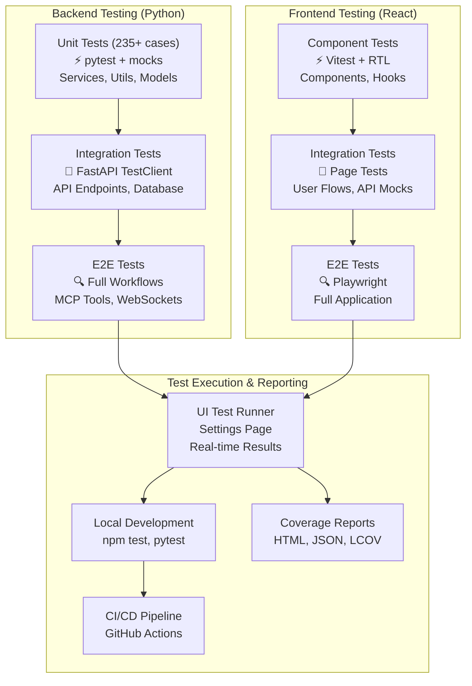

# Testing Overview

Archon employs a comprehensive testing strategy with **235+ test cases** across both backend (Python/pytest) and frontend (React/Vitest) components. This guide provides an overview of our testing approach, with detailed strategies available for each technology stack.

## 🎯 Core Testing Principles

1. **Test at the Right Level**: Follow the testing pyramid - many unit tests, fewer integration tests, minimal E2E tests
2. **Fast Feedback**: Tests should run quickly to enable rapid development
3. **Isolation**: Each test should be independent and repeatable
4. **User-Focused**: Test behavior and outcomes, not implementation details
5. **Comprehensive Coverage**: Aim for high coverage of critical paths

## 🏗️ Testing Architecture



## 🚀 UI Test Runner & Results Dashboard

Archon includes a built-in test runner with comprehensive reporting accessible from the Settings page. This provides:

### **Test Results Modal Features**
- **Test Health Score**: Executive summary combining test success rate + coverage percentage
- **Test Summary**: Pass/fail counts, duration, and individual test suite breakdown
- **Coverage Analysis**: Lines, functions, statements, and branches coverage with visual progress bars
- **Color-coded Indicators**: Green ≥80%, Yellow ≥60%, Red `<60%`
- **Real-time Updates**: Button appears automatically after successful test runs

### **Accessing the Test Runner**
1. Navigate to **Settings** in the Archon UI
2. Scroll to the **Archon Unit Tests** section
3. Run React UI tests to generate test results and coverage
4. Click **Test Results** button (appears after tests complete)
5. View comprehensive test health report in modal

### **Key Capabilities**
- **On-Demand Execution**: Run Python and React test suites without command line
- **Streaming Output**: Real-time test results via WebSockets
- **Visual Feedback**: Color-coded status indicators and progress bars
- **Coverage Integration**: Automatic HTML coverage report generation
- **Test History**: Previous test run tracking

## 📋 Testing Strategy Documents

For detailed testing strategies and best practices:

- **[Vitest Testing Strategy](./testing-vitest-strategy)** - Comprehensive React & TypeScript testing guide
- **[Python Testing Strategy](./testing-python-strategy)** - Backend testing with pytest

## 📁 Test Directory Structure

### Frontend (React/TypeScript)

```
archon-ui-main/
├── vitest.config.ts           # Vitest configuration with coverage
├── vite.config.ts             # Dev server with test endpoints
├── test/
│   ├── setup.ts              # Enhanced test setup with mocks
│   ├── README_TEST_GUIDE.md   # Comprehensive testing guide
│   ├── TEST_STRUCTURE.md      # File structure documentation
│   ├── components/           # Component tests (73 files)
│   │   ├── ui/               # UI component tests
│   │   ├── layouts/          # Layout component tests
│   │   ├── mcp/              # MCP component tests
│   │   ├── settings/         # Settings component tests
│   │   └── project-tasks/    # Project task component tests
│   ├── services/             # Service layer tests (12 files)
│   ├── pages/                # Page component tests (5 files)
│   ├── hooks/                # Custom hook tests (2 files)
│   ├── contexts/             # Context provider tests (3 files)
│   ├── lib/                  # Utility function tests (2 files)
│   ├── integration/          # Integration tests (8 files)
│   ├── e2e/                  # End-to-end tests (5 files)
│   ├── performance/          # Performance tests (3 files)
│   ├── fixtures/             # Test data and mocks
│   └── utils/                # Test utilities
└── coverage/                 # Generated coverage reports
    ├── index.html            # HTML coverage report
    ├── coverage-summary.json # Coverage summary
    └── test-results.json     # Test execution results
```

### Backend (Python)

```
python/
├── tests/                   # Backend test suite
│   ├── unit/                # Unit tests (235+ test cases)
│   │   ├── test_agents/     # Agent tests (BaseAgent, DocumentAgent, RagAgent)
│   │   ├── test_api/        # API endpoint tests
│   │   ├── test_models/     # Model validation tests
│   │   ├── test_modules/    # Module tests (project, rag)
│   │   ├── test_services/   # Service layer tests
│   │   │   ├── test_projects/   # Project service tests
│   │   │   └── test_rag/        # RAG service tests
│   │   └── test_utils/      # Utility function tests
│   ├── integration/         # Integration tests
│   │   ├── test_api/        # API integration tests
│   │   ├── test_database/   # Database integration
│   │   ├── test_mcp/        # MCP integration
│   │   └── test_websockets/ # WebSocket tests
│   ├── e2e/                 # End-to-end tests
│   │   ├── test_workflows/  # Complete user workflows
│   │   └── test_mcp_tools/  # MCP tool integration
│   ├── performance/         # Performance tests
│   │   └── test_performance.py
│   ├── fixtures/            # Test fixtures and data
│   │   ├── mock_data.py     # Factory patterns for test data
│   │   └── test_helpers.py  # Testing utilities
│   ├── conftest.py         # Pytest configuration
│   ├── pytest.ini          # Pytest settings
│   ├── .coveragerc         # Coverage configuration
│   └── run_tests.py        # Test runner with filtering
├── src/                     # Application source code
└── pyproject.toml          # Python project configuration
```

## 🔧 Test Configuration

### Frontend Vitest Configuration

```typescript
// vitest.config.ts
export default defineConfig({
  plugins: [react()],
  test: {
    globals: true,
    environment: 'jsdom',
    setupFiles: './test/setup.ts',
    include: ['test/**/*.{test,spec}.{js,mjs,cjs,ts,mts,cts,jsx,tsx}'],
    exclude: ['node_modules', 'dist', '.git', '.cache'],
    reporters: ['default', 'json'],
    outputFile: { 
      json: './coverage/test-results.json' 
    },
    coverage: {
      provider: 'v8',
      reporter: [
        'text-summary', 
        'html', 
        'json', 
        'json-summary',
        'lcov'
      ],
      reportsDirectory: './coverage',
      thresholds: {
        global: {
          statements: 70,
          branches: 65,
          functions: 70,
          lines: 70,
        },
        'src/services/**/*.ts': {
          statements: 80,
          branches: 75,
          functions: 80,
          lines: 80,
        }
      }
    },
  },
})
```

### Enhanced Test Setup

```typescript
// test/setup.ts - Comprehensive test environment setup
import '@testing-library/jest-dom'
import { vi } from 'vitest'

// Comprehensive Lucide React icon mocks (170+ icons)
vi.mock('lucide-react', () => ({
  Settings: ({ className, ...props }: any) => 
    React.createElement('span', { 
      className, 
      'data-testid': 'settings-icon',
      'data-lucide': 'Settings',
      ...props 
    }, 'Settings'),
  // ... 170+ icon mocks
}))

// Enhanced WebSocket mocking with lifecycle simulation
export class MockWebSocket {
  static CONNECTING = 0
  static OPEN = 1
  static CLOSING = 2
  static CLOSED = 3

  constructor(url: string) {
    this.url = url
    // Simulate connection opening asynchronously
    setTimeout(() => {
      this.readyState = MockWebSocket.OPEN
      if (this.onopen) {
        this.onopen(new Event('open'))
      }
    }, 0)
  }

  send = vi.fn()
  close = vi.fn(() => {
    this.readyState = MockWebSocket.CLOSED
    if (this.onclose) {
      this.onclose(new CloseEvent('close'))
    }
  })
}

// Enhanced WebSocket service mock
vi.mock('@/services/websocketService', () => ({
  websocketService: {
    connect: vi.fn().mockResolvedValue(undefined),
    disconnect: vi.fn(),
    subscribe: vi.fn().mockReturnValue(vi.fn()),
    send: vi.fn(),
    getConnectionState: vi.fn().mockReturnValue('connected')
  }
}))
```

### Backend Test Setup

```bash
# Navigate to python directory
cd python

# Install dependencies using uv
uv sync

# Or install test dependencies manually
uv pip install pytest pytest-asyncio pytest-cov pytest-timeout pytest-mock
```

## 🚀 Quick Start Commands

### Frontend Testing (React/Vitest)

```bash
# Navigate to frontend directory
cd archon-ui-main

# Run all tests
npm test

# Run with coverage
npm run test:coverage

# Run with UI
npm run test:ui

# Run in watch mode
npm run test:watch
```

### Backend Testing (Python)

```bash
# Run all tests using the test runner
python tests/run_tests.py

# Run tests by type
python tests/run_tests.py --type unit
python tests/run_tests.py --type integration
python tests/run_tests.py --type e2e

# Run tests by priority
python tests/run_tests.py --priority critical
python tests/run_tests.py --priority high
python tests/run_tests.py --priority standard

# Run with coverage report
python tests/run_tests.py --coverage

# Run specific test categories with pytest directly
PYTHONPATH=/workspace/python pytest tests/unit/test_services/ -v
PYTHONPATH=/workspace/python pytest tests/unit/test_api/ -v

# Run tests with specific markers
pytest -m "not slow"       # Skip slow tests
pytest -m "critical"       # Run critical tests only
pytest -m "websocket"      # Run WebSocket tests only

# Run in watch mode (requires pytest-watch)
ptw
```

### Running Tests via Docker

```bash
# Run Python tests in Docker
docker-compose run --rm archon-pyserver pytest

# Run React tests in Docker
docker-compose run --rm archon-ui npm test
```

### Running Tests from UI

The Archon UI Settings page provides a test runner interface that connects via WebSocket to stream test results in real-time:

1. Navigate to Settings page in the UI
2. Click on "Run Tests" button
3. Select test type (Unit Tests or UI Tests)
4. View real-time test output and results

## 🔧 Test Configuration Details

### pytest.ini

```ini
[tool:pytest]
minversion = 6.0
addopts = 
    -ra
    --strict-markers
    --strict-config
    --cov=src
    --cov-branch
    --cov-report=term-missing:skip-covered
    --cov-report=html:htmlcov
    --cov-report=xml
    --cov-fail-under=80
testpaths = tests
python_files = test_*.py
python_classes = Test*
python_functions = test_*
asyncio_mode = auto
asyncio_default_fixture_loop_scope = function
markers =
    slow: marks tests as slow (deselect with '-m "not slow"')
    critical: critical functionality tests
    high: high priority tests
    standard: standard priority tests
    nice_to_have: nice to have tests
    unit: unit tests
    integration: integration tests
    e2e: end-to-end tests
    performance: performance tests
    websocket: WebSocket-related tests
    mcp: MCP-related tests
    rag: RAG-related tests
    auth: authentication tests
```

### Coverage Configuration (.coveragerc)

```ini
[run]
source = src
omit = 
    */tests/*
    */test_*
    */__pycache__/*
    */venv/*
    */.venv/*
    */migrations/*
    */alembic/*
    */conftest.py
    */setup.py
    */config.py
parallel = true
concurrency = multiprocessing,thread

[report]
precision = 2
show_missing = true
skip_covered = false
fail_under = 80
exclude_lines =
    pragma: no cover
    def __repr__
    raise AssertionError
    raise NotImplementedError
    if __name__ == .__main__.:
    if TYPE_CHECKING:
    @abstractmethod
    @abc.abstractmethod
```

## 🧪 Test Categories by Priority

### Critical Priority Tests (137 cases)
- **ProjectService** (15 cases): CRUD operations, validation, linked sources
- **TaskService** (14 cases): Status transitions, subtasks, archiving, WebSocket updates
- **DocumentService** (12 cases): JSONB operations, version snapshots
- **CredentialService** (13 cases): Encryption/decryption, environment variables
- **MCPClientService** (12 cases): SSE transport, tool execution, auto-reconnection
- **VersioningService** (10 cases): Version history, restoration
- **MCPSessionManager** (12 cases): Session lifecycle, expiration
- **CrawlingService** (11 cases): Single/batch crawling, robots.txt
- **DocumentStorageService** (13 cases): Chunking, embeddings, batch operations
- **SearchService** (13 cases): Vector search, reranking, hybrid search
- **Utils** (12 cases): Embeddings, Supabase client, text extraction

### High Priority Tests (20 cases)
- **PromptService** (10 cases): Singleton pattern, template caching
- **SourceManagementService** (10 cases): Source CRUD, metadata management

### Standard Priority Tests (78+ cases)
- **BaseAgent** (10 cases): Rate limiting, streaming, timeout handling
- **DocumentAgent** (8 cases): Conversational document interactions
- **RagAgent** (12 cases): Search and retrieval operations
- **API Endpoints**: Projects, Settings, Knowledge, MCP, Agent Chat
- **Configuration**: Environment validation, settings management

## 🔍 Key Testing Patterns

### Async Testing

```python
import pytest
from unittest.mock import AsyncMock, patch

@pytest.mark.asyncio
async def test_async_operation(mock_service):
    """Test async operations with proper mocking."""
    # Arrange
    mock_service.async_method = AsyncMock(return_value={"status": "success"})
    
    # Act
    result = await mock_service.async_method()
    
    # Assert
    assert result["status"] == "success"
    mock_service.async_method.assert_called_once()
```

### Parametrized Testing

```python
@pytest.mark.parametrize("status,expected", [
    ("todo", True),
    ("in_progress", True),
    ("done", False),
    ("archived", False),
])
def test_task_status_validation(status, expected):
    """Test task status validation with multiple inputs."""
    result = is_task_active(status)
    assert result == expected
```

### WebSocket Testing

```python
@pytest.mark.asyncio
async def test_websocket_task_updates(client: TestClient, test_project):
    """Test WebSocket task update notifications."""
    with client.websocket_connect(f"/api/projects/{test_project.id}/tasks/ws") as websocket:
        # Should receive initial tasks
        data = websocket.receive_json()
        assert data["type"] == "initial_tasks"
        
        # Simulate task update
        await update_task_status(test_project.id, "task-1", "doing")
        
        # Should receive update notification
        data = websocket.receive_json()
        assert data["type"] == "tasks_updated"
        assert data["data"]["updated_tasks"][0]["status"] == "doing"
```

## � Coverage Goals

- **Overall**: 80% minimum
- **Critical Services**: 95% minimum  
- **API Endpoints**: 90% minimum
- **New Code**: 90%+ required

## � Debugging Tests

```bash
# Run with debugger
pytest --pdb  # Drop into debugger on failure

# Show local variables
pytest -l

# Run last failed
pytest --lf

# Run failed first
pytest --ff

# Maximum verbosity
pytest -vv

# Show print statements
pytest -s
```

## � CI/CD Integration

Tests are automatically run in CI/CD pipelines with:
- Pre-commit hooks for linting and type checking
- Pull request checks requiring all tests to pass
- Coverage reports uploaded to tracking services
- Performance benchmarks compared against baselines
