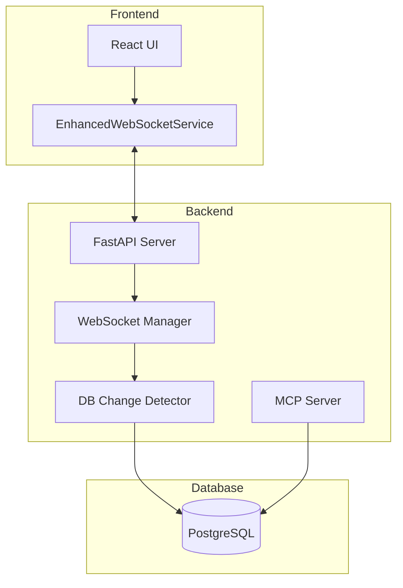

# WebSocket Communication

Real-time bidirectional communication for Archon using WebSockets.

## 🏗️ Architecture Overview



## 📡 WebSocket Endpoints

| Endpoint | Purpose | Message Types |
|----------|---------|---------------|
| `/api/crawl-progress/{id}` | Progress tracking | `crawl_progress`, `crawl_completed`, `heartbeat` |
| `/api/projects/{id}/tasks/ws` | Task updates | `initial_tasks`, `tasks_updated`, `heartbeat` |
| `/api/agent-chat/{session_id}` | Agent chat | `message`, `typing`, `stream_chunk`, `stream_complete` |
| `/api/mcp/logs/stream` | MCP logs | Log entries with timestamp, level, message |

## 🔧 Frontend Implementation

### EnhancedWebSocketService

The core WebSocket service providing automatic reconnection, state management, and typed messages:

```typescript
import { createWebSocketService } from './services/EnhancedWebSocketService';

// Create service with configuration
const wsService = createWebSocketService({
  maxReconnectAttempts: 5,
  reconnectInterval: 1000,
  heartbeatInterval: 30000,
  enableAutoReconnect: true
});

// Connect to endpoint
await wsService.connect('/api/crawl-progress/123');

// Handle messages
wsService.addMessageHandler('crawl_progress', (message) => {
  console.log('Progress:', message.data.percentage);
});

// Monitor connection state
wsService.addStateChangeHandler((state) => {
  console.log('State:', state); // CONNECTING, CONNECTED, RECONNECTING, DISCONNECTED, FAILED
});

// Send messages
wsService.send({ type: 'ping' });

// Disconnect when done
wsService.disconnect();
```

### Task Updates Example

```typescript
const connectTaskWebSocket = (projectId: string, callbacks: TaskUpdateCallbacks) => {
  const service = createWebSocketService();
  
  service.addMessageHandler('tasks_updated', (message) => {
    // Handle bulk updates from AI agents
    callbacks.onTasksChange?.(message.data.updated_tasks);
  });
  
  service.connect(`/api/projects/${projectId}/tasks/ws`);
  return service;
};
```

## 🐍 Backend Implementation

### Basic WebSocket Endpoint

```python
from fastapi import WebSocket, WebSocketDisconnect
import asyncio

@router.websocket("/api/crawl-progress/{progress_id}")
async def websocket_crawl_progress(websocket: WebSocket, progress_id: str):
    await websocket.accept()
    
    try:
        # Send initial state
        await websocket.send_json({
            "type": "crawl_progress",
            "data": {"progressId": progress_id, "status": "starting"}
        })
        
        # Keep connection alive
        while True:
            message = await asyncio.wait_for(websocket.receive_text(), timeout=30.0)
            if message == "ping":
                await websocket.send_json({"type": "pong"})
                
    except WebSocketDisconnect:
        logger.info(f"WebSocket disconnected: {progress_id}")
    except Exception as e:
        logger.error(f"WebSocket error: {e}")
```

### Database Change Detection Pattern

For bridging MCP operations with WebSocket updates:

```python
class DatabaseChangeDetector:
    def __init__(self):
        self.last_check_times = {}
        self.polling_tasks = {}
        self.websocket_connections = {}
        
    async def add_websocket_connection(self, project_id: str, websocket: WebSocket):
        if project_id not in self.websocket_connections:
            self.websocket_connections[project_id] = []
        self.websocket_connections[project_id].append(websocket)
        
        # Start monitoring if first connection
        if len(self.websocket_connections[project_id]) == 1:
            await self._start_monitoring(project_id)
    
    async def _check_and_broadcast_changes(self, project_id: str):
        # Query for changes since last check
        changed_tasks = await db.tasks.filter(
            project_id=project_id,
            updated_at__gt=self.last_check_times[project_id]
        )
        
        if changed_tasks:
            # Broadcast to all connections
            await self._broadcast_to_project(project_id, {
                "type": "tasks_updated",
                "data": {"updated_tasks": changed_tasks}
            })
```

## 💡 Best Practices

### Connection Management

**DO:**
- ✅ Use `await` when connecting
- ✅ Clean up on component unmount
- ✅ Handle all connection states
- ✅ Use typed message handlers

**DON'T:**
- ❌ Create multiple connections to same endpoint
- ❌ Forget to disconnect when done
- ❌ Include unstable functions in callbacks
- ❌ Ignore error states

### Message Serialization

**Always convert datetime objects:**
```python
# ✅ Correct
for key, value in data.items():
    if hasattr(value, 'isoformat'):
        data[key] = value.isoformat()

# ❌ Wrong - will fail JSON serialization
await websocket.send_json({"timestamp": datetime.now()})
```

**Handle Supabase booleans:**
```python
# ✅ Correct - use string literals
.eq("archived", "false")

# ❌ Wrong - causes 400 error
.eq("archived", False)
```

### React Component Pattern

```typescript
useEffect(() => {
  if (!projectId) return;
  
  const ws = createWebSocketService();
  
  ws.addMessageHandler('tasks_updated', (message) => {
    setTasks(prev => {
      // Update efficiently with Map
      const taskMap = new Map(prev.map(t => [t.id, t]));
      message.data.updated_tasks.forEach(task => {
        taskMap.set(task.id, task);
      });
      return Array.from(taskMap.values());
    });
  });
  
  ws.connect(`/api/projects/${projectId}/tasks/ws`);
  
  return () => ws.disconnect();
}, [projectId]); // Only stable dependencies
```

## 🔍 Troubleshooting

### Common Issues

**Connection Refused**
- Check backend is running: `curl http://localhost:8080/health`
- Verify correct port (8080 for backend)
- Check CORS configuration

**No Updates Received**
- Check message handler is registered before connecting
- Verify endpoint URL is correct
- Check backend logs for errors

**Constant Reconnections**
- Look for unstable dependencies in useCallback/useEffect
- Check for datetime serialization errors
- Verify WebSocket endpoint exists

**Memory Leaks**
- Ensure cleanup in useEffect return
- Remove handlers when disconnecting
- Clear any intervals/timeouts

### Debug Commands

```bash
# Test WebSocket endpoint
wscat -c ws://localhost:8080/api/crawl-progress/test-id

# Check backend logs
docker-compose logs archon-pyserver --tail=50 | grep WebSocket

# Monitor connections
curl http://localhost:8080/api/debug/websocket-connections
```

### Logging Pattern

**Frontend:**
```typescript
console.log('🔌 Connecting...', endpoint);
console.log('✅ Connected');
console.log('📨 Message:', message);
console.log('❌ Error:', error);
console.log('🔄 Reconnecting...');
```

**Backend:**
```python
logger.info("WebSocket connected", extra={"endpoint": endpoint})
logger.error("WebSocket error", exc_info=True)
```

## 🧪 Testing WebSockets

### Frontend Test

```typescript
import { renderHook, act } from '@testing-library/react';
import WS from 'vitest-websocket-mock';

test('handles WebSocket messages', async () => {
  const server = new WS('ws://localhost:8080/ws');
  
  const { result } = renderHook(() => 
    useWebSocket('ws://localhost:8080/ws')
  );
  
  await server.connected;
  
  act(() => {
    server.send(JSON.stringify({ type: 'update', data: 'test' }));
  });
  
  expect(result.current.lastMessage).toEqual({ type: 'update', data: 'test' });
});
```

### Backend Test

```python
import pytest
from httpx import AsyncClient

@pytest.mark.asyncio
async def test_websocket_connection(client: AsyncClient):
    with client.websocket_connect("/api/ws") as websocket:
        # Send message
        websocket.send_json({"type": "ping"})
        
        # Receive response
        response = websocket.receive_json()
        assert response["type"] == "pong"
```

## 📚 Additional Resources

- [EnhancedWebSocketService Source](./EnhancedWebSocketService.ts)
- [Migration Guide](./WEBSOCKET_MIGRATION_GUIDE.md)
- [API Reference](./api-reference)